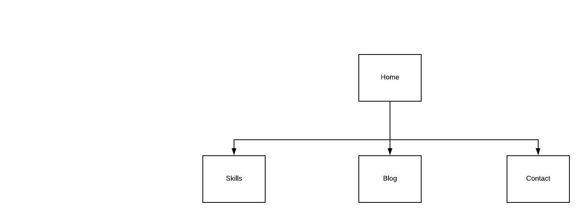
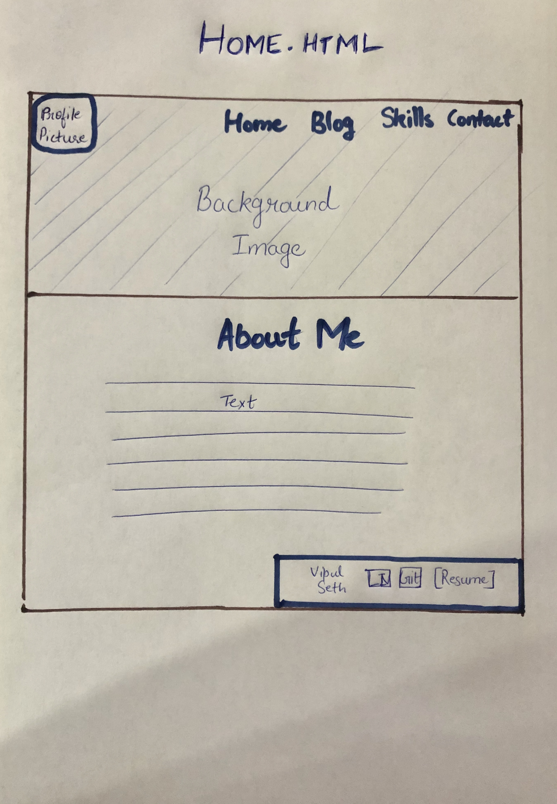
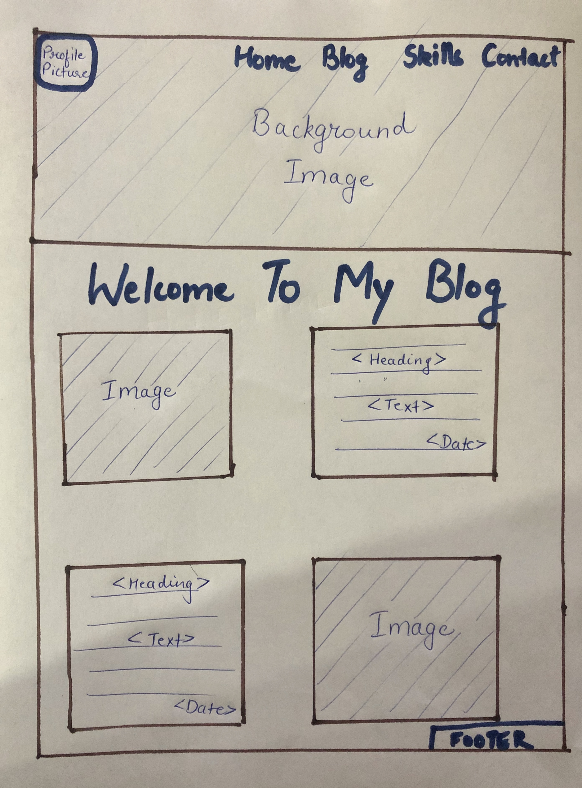
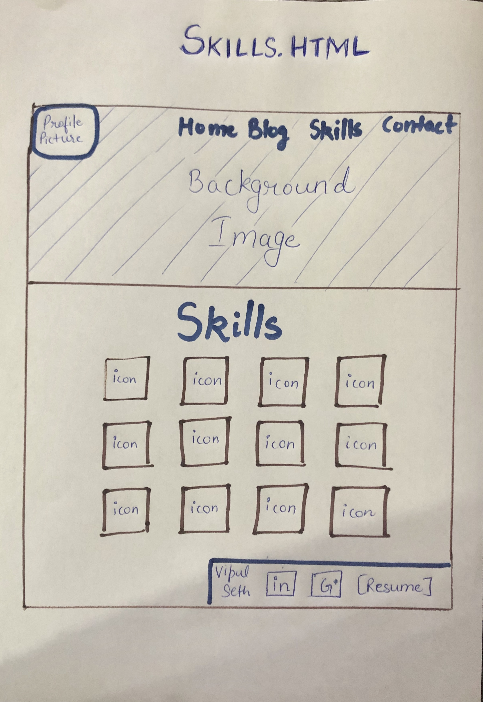
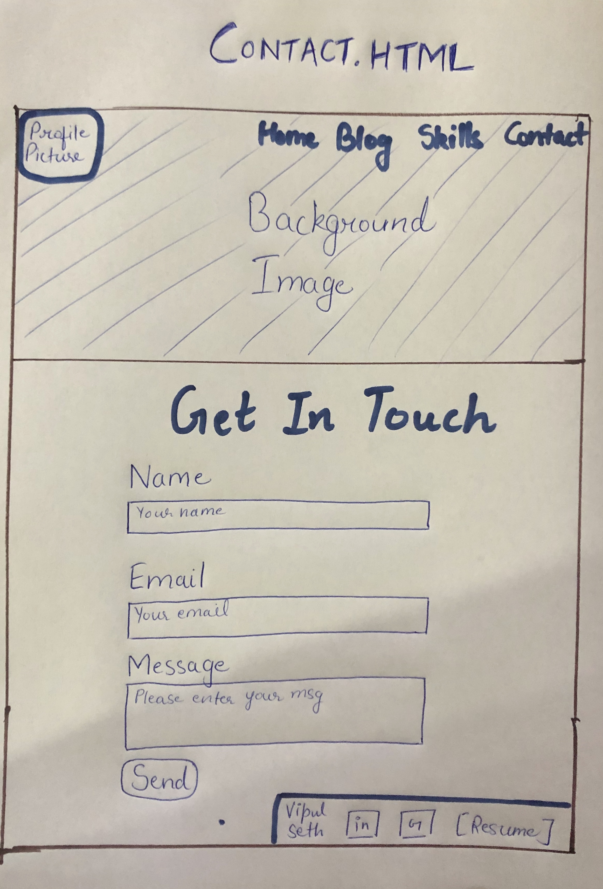

# Vipul Seth Portfolio Website-T1a3

## Website: https://vipulseth.netlify.com/

## Github: https://github.com/vipul022/vipul022-my-portfolio

# Purpose

The purpose of the portfolio website is to present my skills, interests, and work history to potential employers. This will increase my visibility to others in the technology industry, which will assist in gaining employment.

# Functionality and Features

## 1. Navigation bar

The site has a navigation bar on the top. On the top-right corner, it has links to navigate to different pages of the site which include home, blog, skills, and contact.

## 2. background image

There is big background image of a busy street of Melbourne CBD.

## 3. Header

There is a header beneath the background image of every page to inform the users about the content that page.

## 4. Footer

The footer is placed on the bottom-right corner of the background image. The footer contains the links to my LinkedIn account, Github account, and resume.

## 5. Accessibility

Special attention has been paid to the ability of visually-impaired individuals on this site by using semantic HTML. There is an alt-text also given for all the images on the site for assistance.

## 6. Responsive Design

As users may use different devices to access the site so the attention has been paid to design the website so that it functions well on screens of different sizes.

# Sitemap

The sitemap for the website is presented below.



## Wireframes









# Target audience

The target audience for the website is my future employers and recruiters. The website intends to showcase my talent as a software developer.

## Tech stack

1. HTML is used for making all the contents of the website.
2. CSS is used to style and position all the elements of the website.
3. Netlify is used to host the website.

```
The End!
```